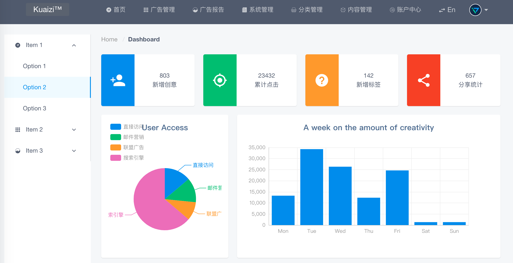

# vue-cli-preset-kz

vue项目开发预设模板

[https://kuaizi-co.github.io/vue-cli-preset-kz](https://kuaizi-co.github.io/vue-cli-preset-kz)

## Install

```
# 首先安装vue-cli 3.0
> npm install -g @vue/cli

> vue create --preset kuaizi-co/vue-cli-preset-kz project-name --no-git

# OR more faster!!!
# - project-name
# - vue-cli-preset-kz
project-name> cd ..
> git clone https://github.com/Kuaizi-co/vue-cli-preset-kz.git
> cd vue-cli-preset-kz
> git pull origin master
> cd ..
> vue create --preset ./vue-cli-preset-kz project-name --no-git
```

## Develop

```
npm run dev
```

## Build

```
npm run build
```

## Review

```
npm run review
```

## 功能列表

- [x] postcss/less/sass
- [x] ES6/Typescript
- [x] element-ui/iview
- [x] vue-router/vuex
- [x] mock server
- [x] style-resources-loader
- [x] i18n
- [x] axios
- [x] PWA
- [x] unit(mocha)/e2e(Nightwatch)
- [ ] nuxt.js/egg.js

### css预处理器全局变量

内置`style-resources-loader`，支持`less`、`sass` 加载全局变量文件。

```
# vue.config.js
/**
 * 样式预处理器全局变量资源插件
 * @param {String} rule webpack 规则
 */
function addStyleResource (rule) {
  rule.use('style-resource')
    .loader('style-resources-loader')
    .options({
      patterns: [
        resolve('./src/assets/less/var.less')
      ]
    })
}
```

在`*.vue`文件中直接使用 `var.less(scss)`定义的变量，增加共同`mixin`只需手动添加文件的路径。

```
# App.vue
<style lang="less">
  h1 {
    // @color 在var.less中定义
    color: @color;
  }
</style>
```

### preset模板

当前 preset 模板暂只有 `default` 默认模板，对于 `ts`、`egg`、`nuxt` 模板添加时间待定。

### UI 框架

本 preset 支持 `element-ui` 和 `iview`（默认）两种。



iView


element-ui

### I18n 多语言

多语言采用模块异步延迟加载方式，首先检测语言环境及用户上次使用的语言。在切换语言后，如果尚未加载的语言包将从服务器中加载，达到项目按需加载资源优化。

```
src
   i18n
      index.js
      zh-CN.js
      en-US.js
```


英文版页面

### 多页模式

通过配置`vue.config.js`的`pages`参数，默认读取 `src/pages`下的各个目录

```
- src
  - pages
    - index
      - components
      - routes
      - store
      - views
      App.vue
      index.html
      main.js
    - about
```

每个单页基本包含3个文件

```
App.vue
index.html
main.js
```

# 
copyright (c) www.kuaizi.ai